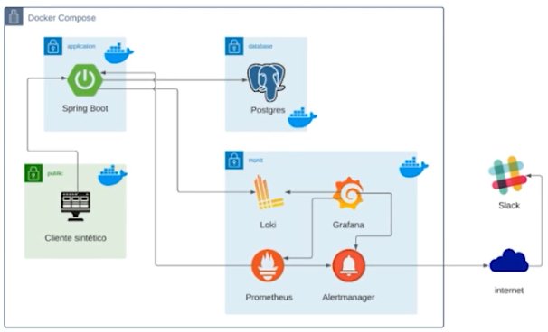

## Esquema da aplicação


## Instalações
- [Docker Desktop](https://docs.docker.com/desktop/install/windows-install/)
- [WSL](https://learn.microsoft.com/pt-br/windows/wsl/install)
- [Docker Compose](https://docs.docker.com/compose/install/)
- [Maven](https://maven.apache.org/install.html)
- [Java](https://www.oracle.com/java/technologies/downloads/)
  - [JDK 11](https://www.oracle.com/br/java/technologies/javase/jdk11-archive-downloads.html)
- IDE ([IntelliJ](https://www.jetbrains.com/pt-br/idea/#), [Eclipse](https://eclipseide.org/), etc.)

## Iniciando a aplicação
- Em caso de falha durante a geração da tabela do banco...
    - Exclua a pasta `postgres/data`, deixando apenas a `postgress/db`.
    - Após reiniciado o servidor, execute:
        ```sql
        CREATE TABLE CURSO (
        id UUID PRIMARY KEY DEFAULT gen_random_uuid(),
        numero_matricula VARCHAR(10) NOT NULL UNIQUE,
        numero_curso VARCHAR(10) NOT NULL UNIQUE,
        nome_curso VARCHAR(120) NOT NULL,
        categoria_curso VARCHAR(120) NOT NULL,
        pre_requisito VARCHAR(120) NOT NULL,
        nome_professor VARCHAR(120) NOT NULL,
        periodo_curso VARCHAR(30) NOT NULL,
        data_inscricao TIMESTAMP NOT NULL
        );
        
        INSERT INTO CURSO VALUES
        (
        gen_random_uuid(),
        'MAT001',
        'CUR001',
        'Java Avançado',
        'Programação',
        'Java Básico',
        'Ana Silva',
        'Noturno',
        '2024-06-01 19:00:00'
        ),
        (
        gen_random_uuid(),
        'MAT002',
        'CUR002',
        'Spring Boot',
        'Frameworks',
        'Java Avançado',
        'Carlos Souza',
        'Integral',
        '2024-06-02 08:30:00'
        ),
        (
        gen_random_uuid(),
        'MAT003',
        'CUR003',
        'Banco de Dados PostgreSQL',
        'Banco de Dados',
        'SQL Básico',
        'Marina Costa',
        'Matutino',
        '2024-06-03 10:00:00'
        );
        ```
